# ER Diagram — Enterprise LMS Platform

> **Feature 02 · Database Architecture** · PostgreSQL + Prisma ORM
> All tables use **UUID** primary keys and soft delete (`deletedAt`).
> Diagrams use Mermaid `erDiagram` syntax.

---

## Legend

| Notation | Meaning                       |
| -------- | ----------------------------- |
| `        |                               | --o{` | One-to-many (parent → child) |
| `}o--    |                               | `     | Many-to-one (child → parent) |
| `        |                               | --    |                              | `   | One-to-one |
| `}o--o{` | Many-to-many                  |
| `PK`     | Primary key (UUID)            |
| `FK`     | Foreign key                   |
| `soft`   | Has `deletedAt` (soft delete) |

---

## 1. Users & RBAC

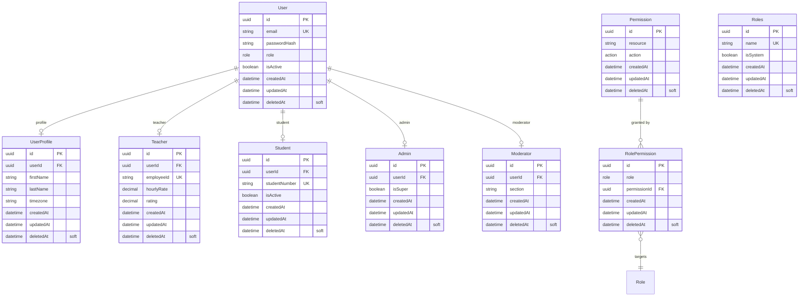

## 2. Authentication

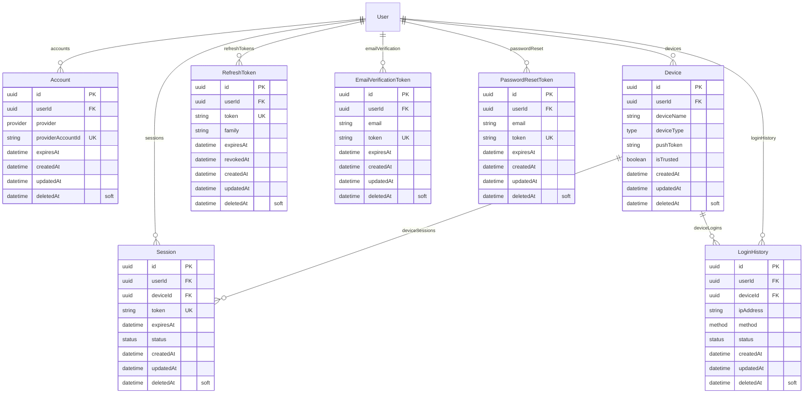

## 3. Courses

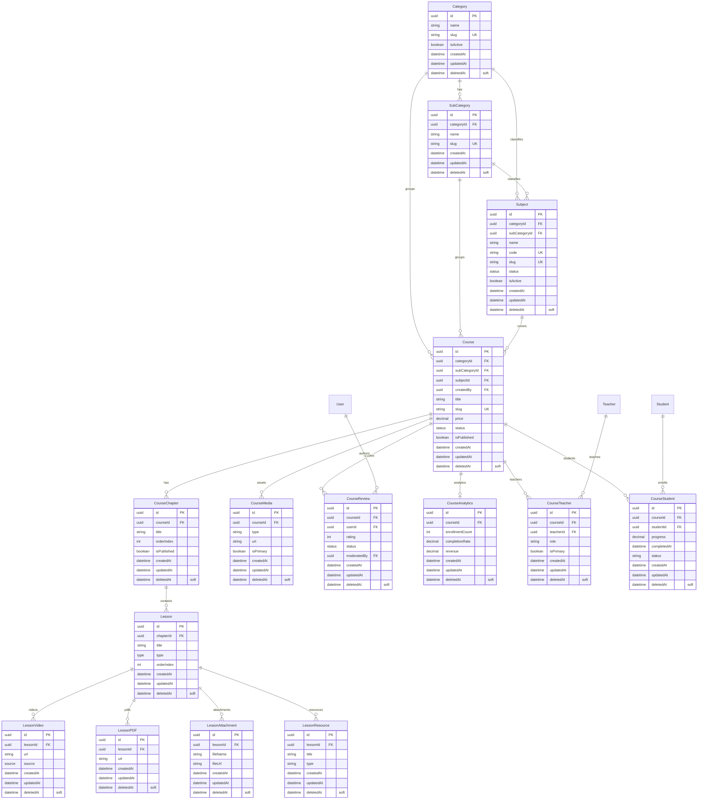

## 4. Live Classes

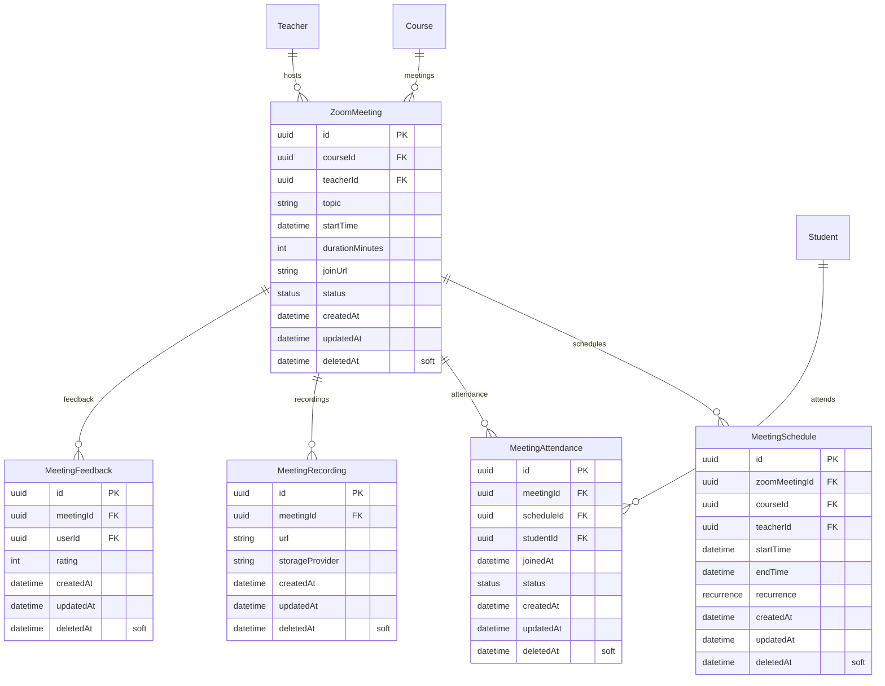

## 5. Booking

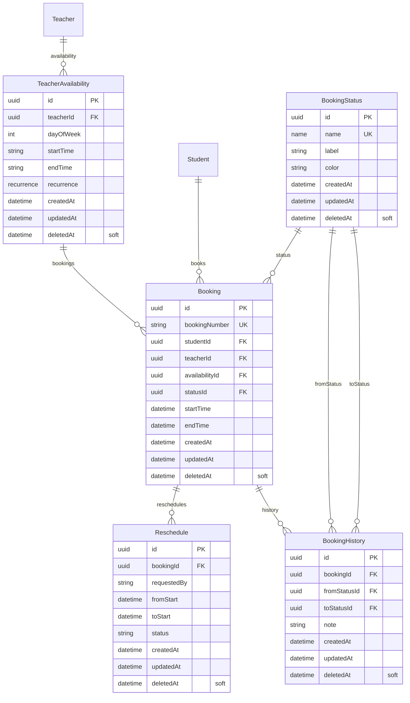

## 6. Calendar

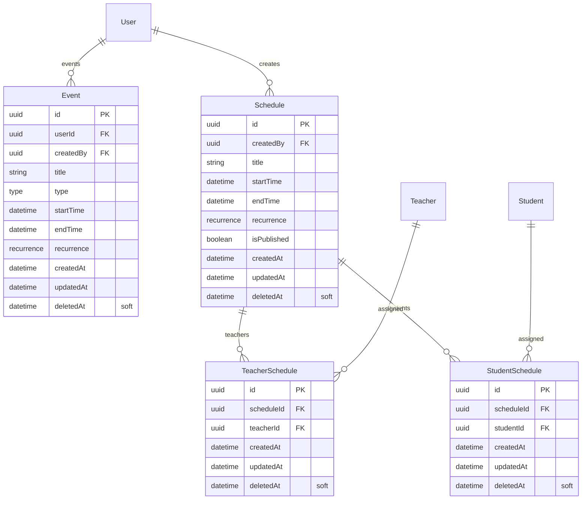

## 7. Exams

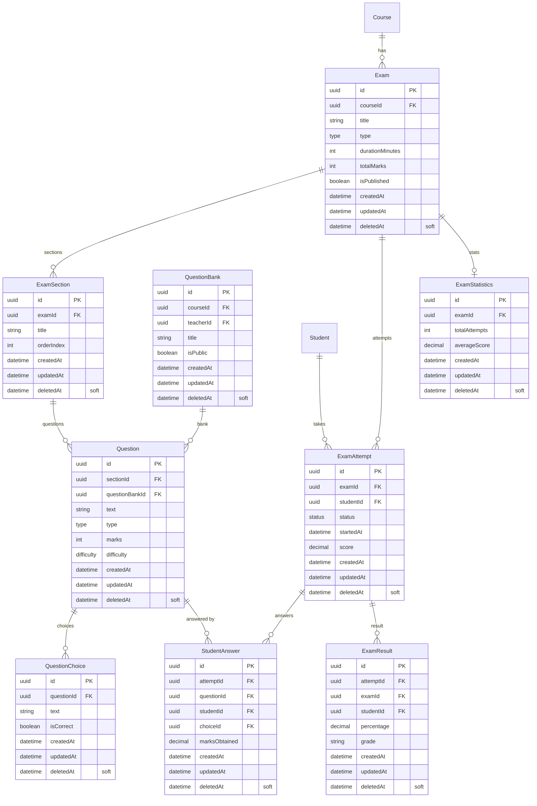

## 8. Homework

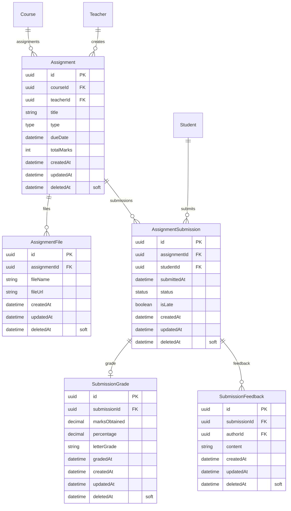

## 9. Files

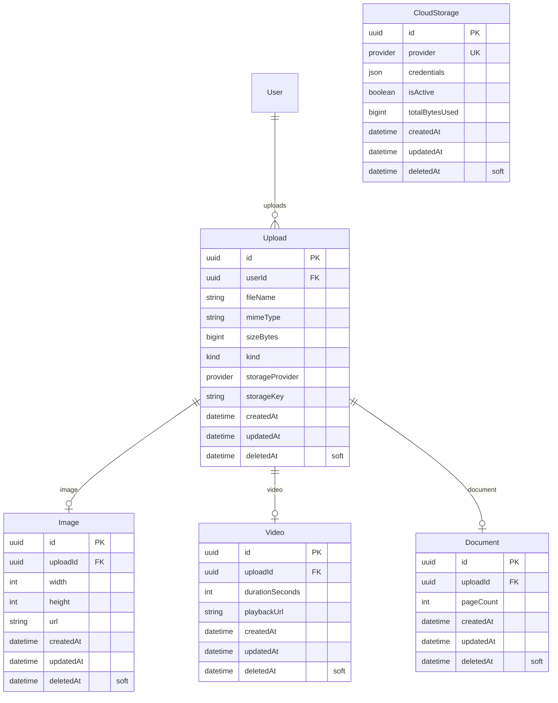

## 10. Chat

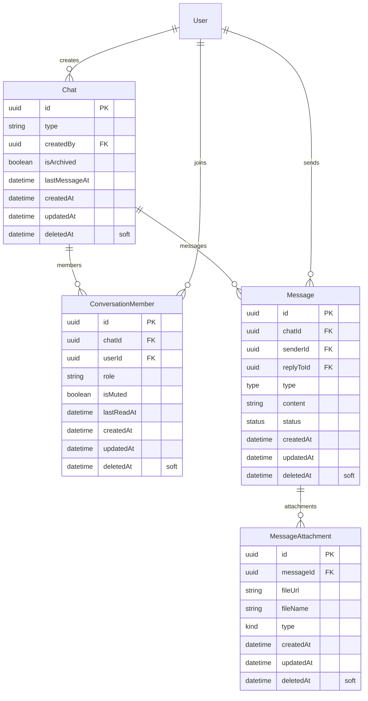

## 11. Notifications

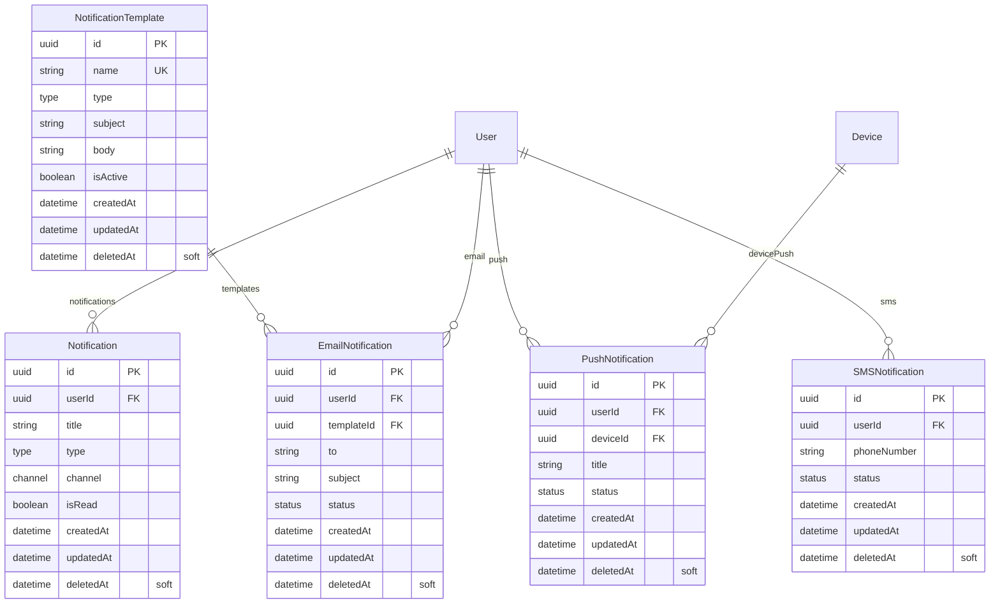

## 12. Certificates

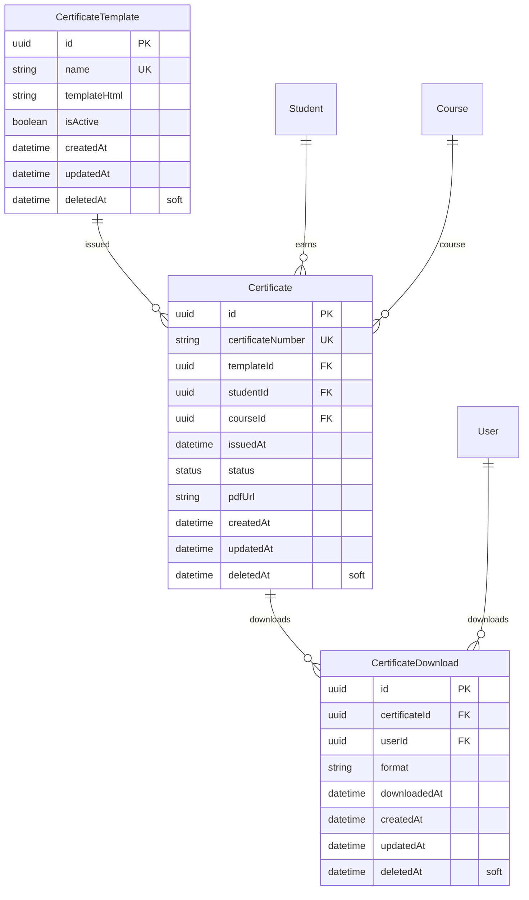

## 13. Payments

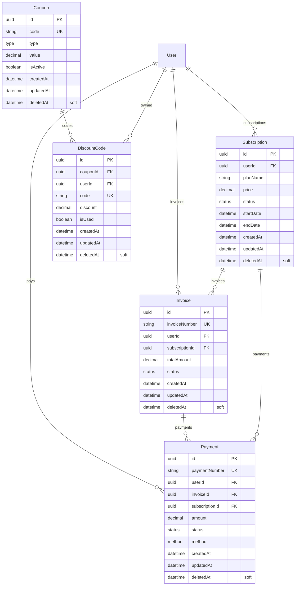

## 14. Reports

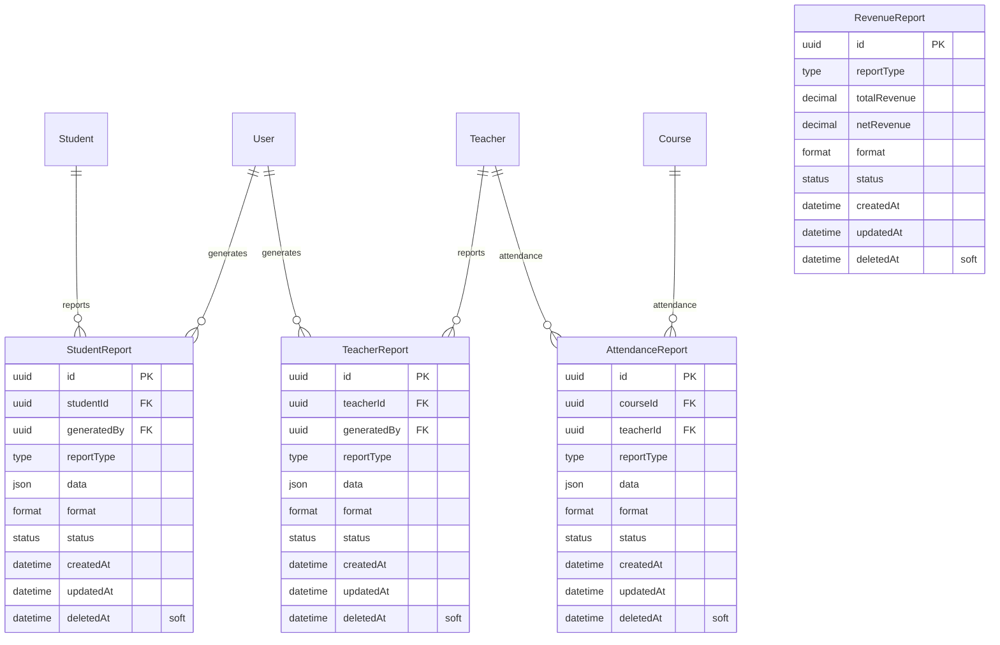

## 15. Feedback

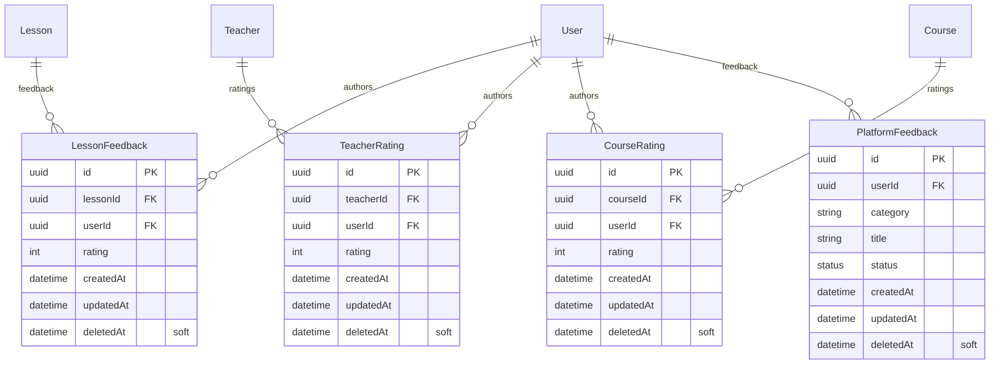

## 16. Audit

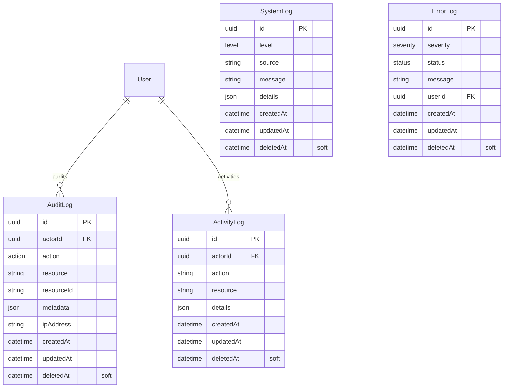

## 17. Settings

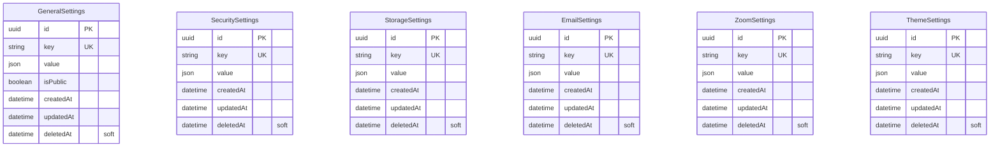

---

## Statistics

| Domain         | Tables  | Relations |
| -------------- | ------- | --------- |
| Users & RBAC   | 9       | 7         |
| Authentication | 7       | 8         |
| Courses        | 15      | 19        |
| Live Classes   | 5       | 6         |
| Booking        | 5       | 7         |
| Calendar       | 4       | 5         |
| Exams          | 9       | 10        |
| Homework       | 5       | 6         |
| Files          | 5       | 4         |
| Chat           | 4       | 5         |
| Notifications  | 5       | 6         |
| Certificates   | 3       | 5         |
| Payments       | 5       | 8         |
| Reports        | 4       | 5         |
| Feedback       | 4       | 6         |
| Audit          | 4       | 2         |
| Settings       | 6       | 0         |
| **Total**      | **~99** | **~109**  |

> See [DATABASE.md](./DATABASE.md) for full model documentation, index strategy, and conventions.
